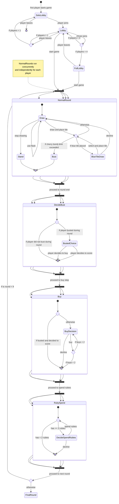

# Snake Oil

```mermaid
stateDiagram-v2


[*] --> SoloLobby : first player starts game
SoloLobby --> Lobby : player joins
SoloLobby --> [*] : player leaves
state leave_if_state <<choice>>
Lobby --> leave_if_state : player leaves
leave_if_state --> Lobby : if players > 1
leave_if_state --> SoloLobby : if players = 1

state join_if_state <<choice>>
Lobby --> join_if_state : player joins
join_if_state --> Lobby : if players < 4
join_if_state --> FullLobby : if players = 4

FullLobby --> Lobby : player leaves

state fork_normal_round <<fork>>
FullLobby --> fork_normal_round : start game
Lobby --> fork_normal_round : start game
fork_normal_round --> NormalRound
fork_normal_round --> NormalRound
fork_normal_round --> NormalRound
fork_normal_round --> NormalRound
note left of fork_normal_round
    NormalRounds run concurrently
    and independently for each player
end note
state NormalRound {
    [*] --> Draw
    Draw --> Stand : stop drawing
    Stand --> [*]
    state draw_if_state <<choice>>
    Draw --> Draw : use flask
    Draw --> draw_if_state : draw and place tile
    draw_if_state --> Bust : if cherry bomb limit exceeded
    Bust --> [*]
    draw_if_state --> BlueTileDraw : if blue tile placed
    BlueTileDraw --> draw_if_state : select and place tile
    BlueTileDraw --> Draw : decline
    draw_if_state --> Draw : otherwise
    
}

state join_normal_round <<join>>
NormalRound --> join_normal_round
NormalRound --> join_normal_round
NormalRound --> join_normal_round
NormalRound --> join_normal_round

state fork_decide_bust <<fork>>
join_normal_round --> fork_decide_bust : proceed to round end
fork_decide_bust --> DecideBust
fork_decide_bust --> DecideBust
fork_decide_bust --> DecideBust
fork_decide_bust --> DecideBust
state DecideBust {
    state if_busted <<choice>>
    [*] --> if_busted
    if_busted --> BustedChoice : if player busted during round
    if_busted --> [*] : if player did not bust during round
    BustedChoice --> [*] : player decides to buy
    BustedChoice --> [*] : player decides to score
}

state join_decide_bust <<join>>
DecideBust --> join_decide_bust
DecideBust --> join_decide_bust
DecideBust --> join_decide_bust
DecideBust --> join_decide_bust

state fork_buy <<fork>>
join_decide_bust --> fork_buy : proceed to buy step
fork_buy --> Buy
fork_buy --> Buy
fork_buy --> Buy
fork_buy --> Buy

state Buy {
    state if_busted_buy <<choice>>
    [*] --> if_busted_buy
    if_busted_buy --> [*] : if busted and decided to score
    if_busted_buy --> BuyDecision : otherwise
    BuyDecision --> [*] : decline
    state if_buy <<choice>>
    BuyDecision --> if_buy : buy
    if_buy --> BuyDecision : if buys < 2
    if_buy --> [*] : if buys = 2
}

state join_buy <<join>>
Buy --> join_buy
Buy --> join_buy
Buy --> join_buy
Buy --> join_buy

state fork_ruby_spend <<fork>>
join_buy --> fork_ruby_spend : proceed to spend rubies
fork_ruby_spend --> RubySpend
fork_ruby_spend --> RubySpend
fork_ruby_spend --> RubySpend
fork_ruby_spend --> RubySpend

state RubySpend {
    state if_has_rubies <<choice>>
    [*] --> if_has_rubies
    if_has_rubies --> [*] : has < 2 rubies
    if_has_rubies --> DecideSpendRubies : has >= 2 rubies
    DecideSpendRubies --> [*] : decline
    DecideSpendRubies --> if_has_rubies : spend rubies
}

state join_ruby_spend <<join>>
RubySpend --> join_ruby_spend
RubySpend --> join_ruby_spend
RubySpend --> join_ruby_spend
RubySpend --> join_ruby_spend

state if_next_round <<choice>>
join_ruby_spend --> if_next_round : proceed to next round
if_next_round --> fork_normal_round : if is round < 9
if_next_round --> FinalRound : otherwise

```
